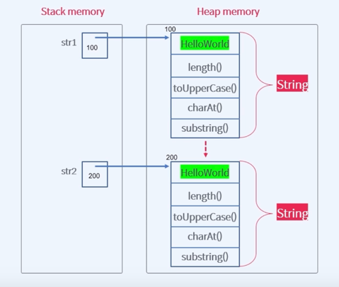
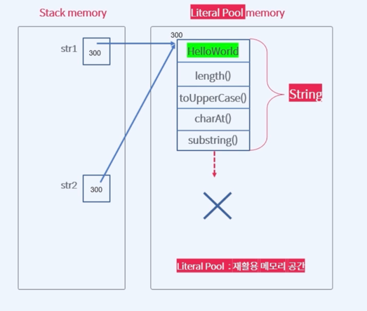

 ## String 객체 비교 이해하기
 
### 문자열 생성

문자열은 자바에서 객체로 취급한다<br>
String 타입으로 객체를 생성하고 처리를 합니다<br>

```java
// 1
String str1 = new String("Hello World");
String str2 = new String("Hello World");

// 2
String str3 = "Hello World";
String str4 = "Hello world";
```


위 사진은 첫번째 new 로 객체를 생성했을 때의 메모리 구조입니다.<br>
String 안에 들어가 있는 값은 같지만, 각각의 객체를 생성했기 때문에 <br>
메모리 공간이 총 2개가 만들어집니다.<br>

그리고 위 객체를 비교해보면 
```java
str1==str2;
str1.equals(str2);
```
> false<br>true

위 결과를 얻게 됩니다. 간단하게 보면은<br>
== 연산자는 Stack 메모리의 주소를 비교합니다<br>
그러므로 두 객체는 각각의 다른 메모리 공간을 가지고 있음으로 false가 나옵니다 <br>

그러나 equals 메소드는 Heap 메모리에 저장된 실제 값을 비교합니다<br>
Heap 메모리에 저장된 두 값은 'Hello World' 로 같은 값을 가지니 true가 나옵니다.


위 사진은 new로 객체를 생성하지 않은 문자열 메모리 입니다.<br>
stack 메모리에 2가지 주소가 생깁니다<br>
그리고 오른쪽에 메모리 공간을 보면 Heap이 아닌 <br>
Literal Pool Memory 라는 공간에 저장되어 있습니다<br>
자바에는 String 문자를 저장하는 공간이 따로 마련되어 있습니다<br>
그 공간은 Literal Pool 이라고 부르고요

일반적인 String 변수를 선언하면 Heap 메모리에 값이 저장되지 않고, <br>
Literal Pool 에 저장이 됩니다.

```java
        String str1 = "abc";
        String str2 = "abc";
        
        
        System.out.println(str1.equals(str2));
        System.out.println(str1==str2);
```

위 값을 비교를 하면은
> true<br>true

가 나옵니다. 왜그럴까요?<br>

String 은 이미 만들어진 변수와 같은 값을 가진 변수가 있으면<br>
객체를 새로 만들지 않고, 같은 주소를 가리키게 만든다<br>

그게 가능한 이유는 Literal Pool 은 재활용이 가능한 성질이 있기 때문입니다<br>

그래서 == ,equals()를 비교해도 true 가 나오는 것 입니다.


그럼 이번에는 위 new로 생성한 객체와 new가 없이 생성한 객체를 비교하면 같은 문자로 취급할까?<br>
라는 궁금증이 생겼습니다.

그래서 테스트를 해본 결과 **false** 가 나왔습니다.<br>
왜 그런걸까요?

이제 한번 알아보겠습니다.

```java
public class Ex1 {
    public static void main(String[] args) {
        String str1 = "abc";
        String str2 = new String("abc");

        System.out.println(str1==str2);
        System.out.println(str1.equals(str2));
    }
}

```
>false<br>
true

위 코드를 실행시켜보면 위와 같은 결과가 나오게 됩니다.

왜 그런지를 이해하고 위해선 JVM 메모리에 대한 이해가 필요 합니다. 

자바에서 new 는 객체를 생성할 때 사용한다.<br>
new 를 사용하면, Heap Memory에 객체를 생성을 하는 것이다<br>

위 코드를 보면 한개는 new 를 썻고, 한개는 new 를 쓰지 않았다<br>

다시 설명을 하자면

new를 사용하지 않고, 변수를 선언한 경우에는 <br>
Heap 메모리에 변수가 저장되지 않고 <br>

JVM 에 String 변수를 저장할 LiteralPool Memory 에 따로 저장이 됩니다.<br>

LiteralPool 은 재활용 메모리 공간이라고도 불립니다.

보통 객체 같은 경우에는 

Stack 메모리에 객체의 주소가 저장되어 있고

Heap 메모리에 객체의 값이 들어가 있습니다.

위 설명을 보고 차이를 보자면, 일반적으로

== 비교연산자를 통해서 비교를 하면, 

== 비교 연산자는 Stack 메모리를 비교합니다. 

그러므로 == 연산자를 통해서 비교를 하면은 주소가 다르니
> false

가 나옵니다

그러나 equals 메소드를 통해서 비교를 해보면

equals 메소드는 Heap 메모리의 값을 직접 비교를 합니다.

그러면 결과는
> true

가 나오게 됩니다.

문자열을 비교할때는 Stack 이 아닌 Heap 영역을 봐야하기 때문에<br>
'==' 연산자는 사용하지 않는 것이 좋고, equals() 메소드를 사용해야한다


또 다른 방법으로 문자열을 비교하는 방법은

'compareTo()' 메소드를 이용하면 됩니다.

문자열을 사전순으로 비교하며, 두 문자열이 같으면 0을 반환하고,<br>
비교 대상 문자열이 기준 문자열보다 작으면 음수를 크면 양수를 반환합니다.

위 방법은 문자열을 대소를 비교하는 것 입니다. 어떤 문자열이 더 크고 작은지

```java
String str1 = "abc";
String str2 = "abc";
String str3 = "abcd";

System.out.println(str1.compareTo(str2));
System.out.println(str1.compareTo(str3));
```
> 0<br>-1

위 결과를 반환하게 됩니다. 

