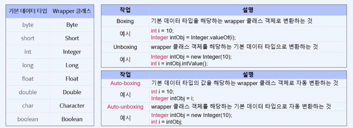

## Collection Framework API

자바 컬렉션 프레임워크 API 자바에서 제공하는 데이터 구조인 
컬렉션을 표현하는 인터페이스와 클래스의 모음 API 이다. 
이 API 를 사용하여 데이터를 저장하고 관리하는 다양한 방법을 학습합니다.

컬렉션 프레임워크에는 원시 타입 자료형을 넣을 수 없다.

그래서 Wrapper 클래스를 사용해야지 컬렉션 프레임워크에 넣을 수 있습니다.
ex) 
- int -> Integer
- double -> Double
- float -> Float

등등 이런식으로 랩퍼 클래스로 변환을 해서 컬렉션에 담아야 한다.

참고로 String 은 String 자체가 객체이기 때문에 상관은 없다.

String 을 자연스럽게 원시타입 처럼 사용은 했지만, 엄연히 따지면 원시타입이 아닌, 
클래스이다. 즉 객체라는 뜻 이다. 

1) Boxing
- 원시 타입 -> 래퍼 타입으로 변환 하는 것
- 1-1) Auto-boxing
  - 기본 데이터 타입 값을 wrapper 클래스 객체로 자동 변환

2) UnBoxing
- 래퍼 타입 -> 원시 타입 으로 변환 하는 것
- 2-1) Auto-UnBoxing
  - wrapper 클래스 객체를 기본 데이터 타입으로 자동 변환하는 것.

### Java Collection API
**1) List**
   - ArrayList (많이 쓰임)
   - LinkedList

순서가 있는 객체의 모음을 다룬다 ( 0 1 2 3 ~) 이런식으로 인덱스로 관리한다.

**2) Set**
   - HashSet (많이 쓰임)
   - TreeSet

중복된 원소가 없는 객체의 모음을 다룬다.

**3) Map**
   - HashMap (많이 쓰임)
   - TreeMap

키,값 쌍의 객체를 다루는 인터페이스 이다.

총 3가지의 큰 분류로 나뉜다. 
Tree 가 들어간 클래스는 정렬된 데이터를 핸들링 한다.