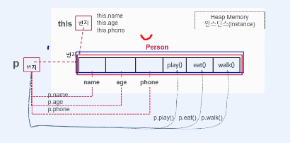

### **사용자 정의 자료형의 이해**

1. 변수를 저장하려면 자료형이 필요하다

Q. 한 권의 **책 데이터**를 저장하기 위한 변수를 선언해야한다


→ ? a; [ ex) Book a = new Book();

이러한 자료형의 사용하기 위해서, 객체 자료형이 필요하다.

책의 메모리로 표현하려면, 변수1개로 가능하나?

→ 아니다 책은 하나의 구조로 만들어 져야 표현하기가 쉽다.

그러면 사용자정의 자료형 → 클래스로 설계한다.

객체(object) = 이질적인 구조 = 모델(model) = 덩어리(value object) = 바구니 = 이동(dto)

여러개의 기억공간(=메모리) 가 한군데 모여서 묶여있다(=객체)

VO, DTO ⇒ Model 이라고 한다.

**MVC패턴에서 VO,DTO객체를 Model에 담아두는 것이다**

즉 모델링을 하기 위해선 **Class**가 필요하다.

클래스 : 객체를 설계 = 모델링하는 도구

**클래스 → 새로운 자료형을 만드는 도구 → 자료형 측면**

객체지향 측면 : 현실세계에 있는 객체를 객체지향 프로그램에서 사용하기 위해

객체의 **상태정보(멤버 변수) 와 행위정보(멤버 메서드)** 를 뽑아서 설계하는 도구 이다.

객체 : 상태정보(멤버변수) + 행위정보(멤버메서드)

사람의 데이터를 저장할 변수를 선언하세요

```jsx
Person p; //추상화된 객체
//객체변수 이다 p

Person p = new Person(); //실체
//p는 인스턴스 변수 이다. -> 실체가 있는 것은 인스턴스라고 부른다. 
```

메모리에 만들어진 객체 ⇒ 인스턴스 라고 한다.

### **생성자 메서드와 this**

- 객체를 메모리에 생성하는 역할을 한다.
    - 생성을 하는 메서드(=행위) → **생성자**
- Person p = new Person(); → new 생성자 메서드() 이다.
    - 메서드는 정의가 되어있는 것이고, 사용하려면 호출을 해야한다.
- 생성자는 클래스를 생성하면 자동으로 기본 생성자가 생성되고, 생략이 되어있다.
    - 접근제한자가 public인 경우에만 호출이 된다.
    - 자신이 가지고 있는 멤버들을 메모리에 올려 객체를 생성하는 역할
    - 생성자는 return 타입이 없다.
    - 객체의 초기화를 위해서 사용된다.

즉 생성자는 **객체를 생성하는 역할**을 한다.

**this : 자신을 가리키는 객체변수 참조변수, 포인터 변수**

객체를 생성을 하면은 그 객체는 **this** 로 부를 수 있다.

자기 자신을 가리키는 것이 this 이다.

즉 객체를 생성을 하면은 그 객체에 번지가 있는데, 그 번지를 가리키는 것이 this이다

객체 생성시 → this또한 만들어진다(하지만 생략되어 있음, 명시하기 전까지)

✔ 객체를 생성한 후 멤버에 접근하는 방법



```java
package oop.클래스;

public class PersonTest {
	public static void main(String[] args) {
		Person p = new Person();
		p.name = "진현규";
		p.age = "26";
		p.phone = "010-1234-5678";
		System.out.println(p.name + "\t" + p.age + "\t" + p.phone);
		p.play();
		p.eat();
		p.walk();

		System.out.println();
		Person p1 = new Person();
		p1.name = "윤성환";
		p1.age = "26";
		p1.phone = "010-2354-0321";
		System.out.println(p1.name + "\t" + p1.age + "\t" + p1.phone);
		p1.play();
		p1.eat();
		p1.walk();
	}
}
```

참고로 객체는 **Heap** 메모리에 생성이 된다. → 객체가 생성되는 영역 **힙 메모리**

클래스를 객체로 사용하면은 재사용성이 좋다.

- 붕어빵 틀이랑 비슷하다. 틀은 1개지만 여러개를 만들어낼 수 있다.

  ⇒ 바로 객체지향 프로그래밍을 핵심이다.